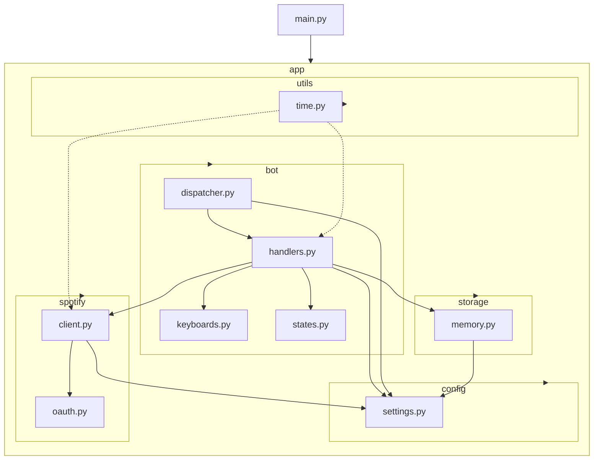
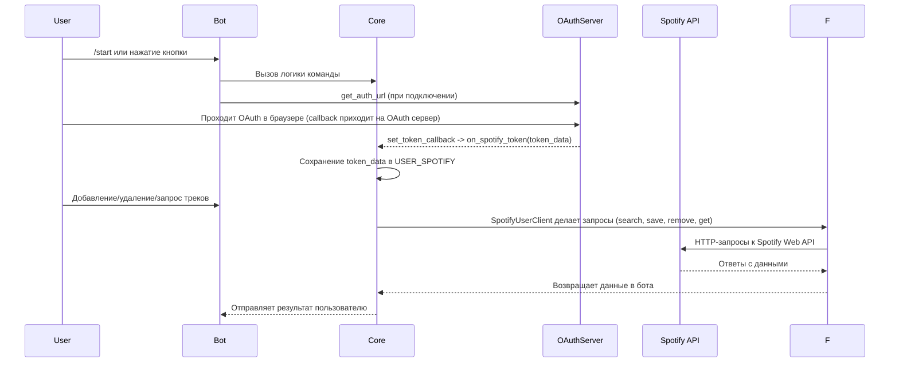

# Spotify SyncBot

## 📋 Оглавление

* [Общее описание](#общее-описание)
* [Что видит пользователь](#что-видит-пользователь)
* [Архитектура](#архитектура)
* [План разработки](#план-разработки)
* [Распределение задач](#распределение-задач)

## Общее описание

Реализованный Telegram-бот, работающий с **Spotify**. На текущий момент функциональность направлена на управление сохраненной библиотекой Spotify пользователя и базовую авторизацию через OAuth. Бот позволяет подключать Spotify-аккаунт, искать треки по запросу, добавлять найденные треки в сохранённые треки пользователя, удалять треки по номерам из последнего списка и просматривать простую статистику использования бота.

### Что реализовано?

* Подключение Spotify через OAuth
* Хранение токенов
* Автоматическое обновление access token при необходимости
* Поиск треков по строке запроса
* Сохранение треков в библиотеку пользователя
* Удаление сохраненных треков
* Получение информации о сохранённых треках
* Проверка, сохранён ли трек
* Простая статистика по пользователям: добавления/удаления, первый/последний добавленный трек, подсчет по артистам

## Что видит пользователь

### Начало работы

* Команда `/start` -> приветствие с указанием состояния подключения Spotify - отображается как "✅ подключён" или "❌ не подключён"
* Отправляется основная клавиатура с кнопками для управления (см. ниже)

### Главное меню (ReplyKeyboard)

* `🔐 Подключить Spotify` — отправляет пользователю ссылку для авторизации
* `🎵 Добавить трек` — переводит пользователя в состояние ввода, бот запрашивает строку поиска трека
* `📂 Мои треки` — показывает последние сохранённые треки
* `🗑 Удалить треки` — показывает последний список треков, где пользователь вводит номера для удаления
* `📊 Статистика` — выводит собранную ботом локальную статистику по пользователю

### Процесс взаимодействия (фактические сообщения)

* **При добавлении:** бот просит ввести название/запрос, затем ищет трек через `Spotify API` и, при успешном результате, сохраняет трек и отправляет карточку с обложкой и информацией:

  * `🎵 Введи название трека`
  * `⚠️ Трек не найден`
  * `✅ Трек добавлен`
  (включая обложку альбома и подпись с артистом и названием)
* **При удалении:** бот выводит список последних треков с нумерацией и ожидает ввода номеров треков для удаления; затем удаляет выбранные треки и отправляет сообщение со списком удаленных треков
* **При запросе статистики:** бот выводит числовые показатели (добавлено через бота, всего треков в Spotify, удалено через бота), любимого исполнителя (по внутреннему счетчику), даты первого/последнего добавления и среднее добавлений в день

## Архитектура

### Общая структура

### Функционал системы (последовательность операций)

## План разработки

### Неделя 1: Базовая инфраструктура

* Настройка проекта (структура, виртуальное окружение, .gitignore, лицензия и прочее)
* Создание базового бота на `aiogram`
* Регистрация приложения в **Spotify For Developers**
* Написание базовой документации

### Неделя 2: Интеграция с Spotify

* Реализация OAuth аутентификации
* Получение данных через `Spotify API`
* Тестирование аутентификации и получения данных
* Определение архитектуры проекта

### Неделя 3: Синхронизация плейлистов

* Добавление функционала бота: добавление треков, удаление, получение статистики и прочее
* Тестирование сделанного функционала
* Декомпозиция кода

### Неделя 4: Тестирование и оптимизация

* Окончательное дописание документации
* Доработка интерфейса бота
* Деплой в **Docker** и настройка мониторинга
* Доделывание тестов и проверка на работоспособность

## Распределение задач

## Team Lead \ Developer 1

### Задача

| Описание                    | Ответственность                                                                                                                   |
| --------------------------- | --------------------------------------------------------------------------------------------------------------------------------- |
| Общая архитектура проекта   | Определение архитектуры, декомпозиция кода |
| Тестирование                | Создание и покрытие кода тестами                                                                                              |
| Введение документации                | Описание работы проекта                                                                                             |

---

## Developer 2

### Задача

| Описание                | Ответственность                                                                                                   |
| ----------------------- | ----------------------------------------------------------------------------------------------------------------- |
| Интеграция OAuth  | Авторизация в бота через OAuth |
| Интеграция Spotify API    | Добавление функционала для дальнейшего использования им через бота          |                                                                        |

---

## Developer 3

### Задача

| Описание                          | Ответственность                                                                                                               |
| --------------------------------- | ----------------------------------------------------------------------------------------------------------------------------- |
| Ядро бота                 | Основной фундамент для внедрения функционала в бота                                                               |
| Обработка команд и ввода                  | Кнопки для взаимодействия с ботом и принятие ввода от пользователя         |
| Пользовательский интерфейс        | Создание интерфейса для комфортного использования                                                                          |

---
