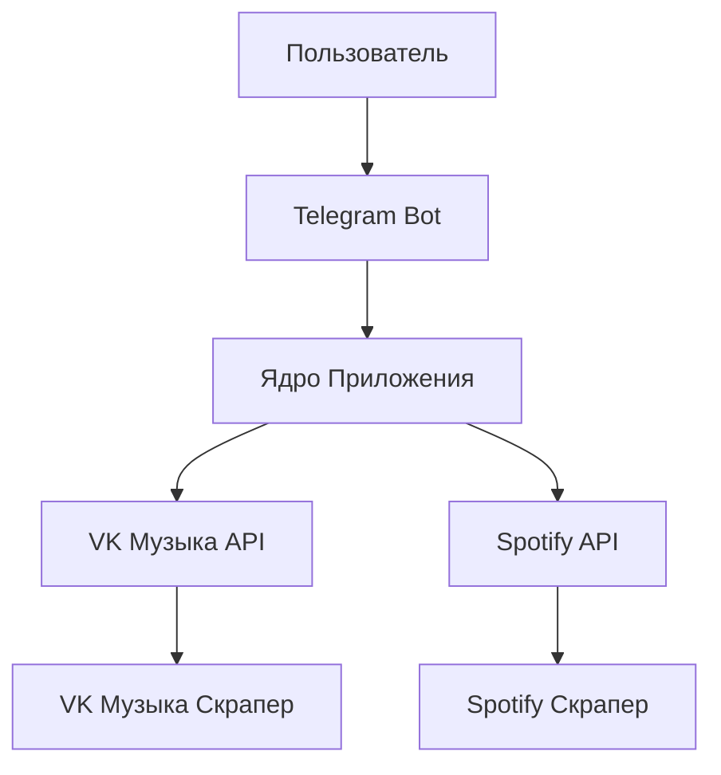
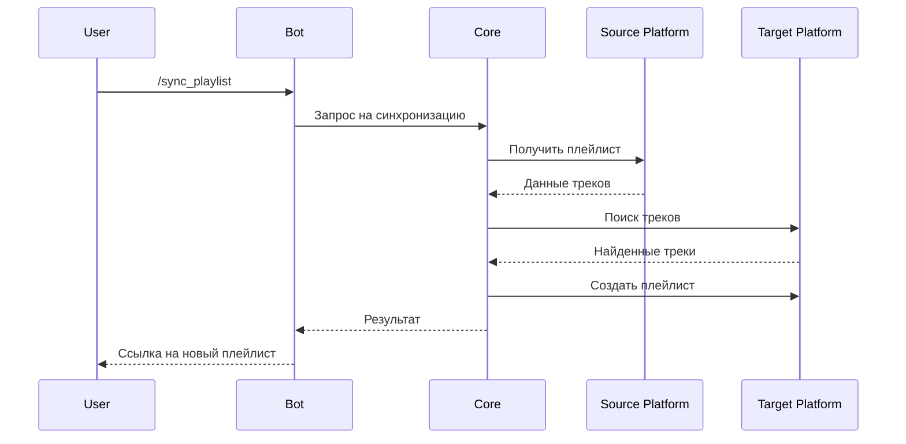

# Telegram-бот синхронизатор плейлистов

## 📋 Оглавление
- [Общее описание](#общее-описание)
- [Что видит пользователь](#что-видит-пользователь)
- [Архитектура системы](#архитектура-системы)
- [План разработки](#план-разработки)
- [Распределение задач](#распределение-задач)

## Общее описание

Telegram-бот для синхронизации плейлистов с платформ Spotify и VK Music. Основные функции:

- Выбор исходной платформы (Spotify, VK musiс)
- Предоставление плейлиста по ссылке или через авторизацию
- Выбор целевой платформы для переноса
- Автоматический поиск треков на выбранной платформе
- Создание нового плейлиста со статистикой совпадений

## Что видит пользователь

### Начало работы
- Команда '/start' → приветствие + кнопка "Начать синхорнизацию"
- Краткое описание возможностей Telegram-бота

### Выбор исходной платформы
- Клавиатура с кнопками: Spotify, VK Musiс
- Инструкция как получить ссылку на плейлист

### Предоставление плейлиста
- Запрос ссылки на плейлист исходной платформы
- Примеры корректных ссылок для каждой платформы
- Кнопка "Отмена" для прерывания процесса

### Выбор целевой платформы
- Клавиатура с кнопками доступных платформ для переноса
- Уведомление о необходимости авторизации (если требуется)

### Процесс синхронизации
- Поэтапные уведомления о статусе:
  - "Получаю треки из Spotify..."
  - "Ищу совпадения в VK Music..."
  - "Создаю новый плейлист..."
- Прогресс-бар или процент выполнения

### Результат
- Ссылка на созданный плейлист
- Статистика: количество перенесенных треков, процент совпадений
- Кнопка "Синхронизировать еще"

##  Архитектура системы

### Общая структура системы

### Функционал системы

##  План разработки

### Неделя 1: Базовая инфраструктура ($\infty$ часов)

-  Настройка проекта (структура, виртуальное окружение, .gitignore, лицензия)
-  Создание базового бота на aiogram (команды /start, /help)
-  Настройка Docker (Dockerfile, docker-compose)
-  Настройка CI/CD и окружения для тестов

### Неделя 2: Интеграция с Spotify ($\infty$ часов)
-  Регистрация приложения в Spotify For Developers
-  Реализация OAuth аутентификации
-  Получение данных плейлиста через Spotify API
-  Парсинг плейлиста (скрапинг)
-  Тестирование

### Неделя 3: Интеграция с VK Music ($\infty$ часов)
-  Изучение VK Music API
-  Авторизация в VK и получение токена
-  Получение данных плейлиста VK
-  Парсинг плейлиста VK (скрапинг)
-  Тестирование

### Неделя 4: Синхронизация плейлистов ($\infty$ часов)

-  Алгоритм совпадений треков (название трека + артист)
-  Создание плейлиста в целевой платформе
-  Реализация полного цикла синхронизации
-  Debugging
-  Тестирование синхронизации

### Неделя 5: Тестирование и оптимизация ($\infty$ часов)

-  Написание тестов 
-  Оптимизация скорости работы и кэширование
-  Доработка интерфейса бота
-  Деплой в облако и настройка мониторинга

# Распределение задач

## Team Lead \ Developer 1

### Задача
| Описание | Ответственность |
|---|---|
| Общая архитектура проекта | Проектирование системы |
| Интеграция Spotify API | OAuth, получение плейлистов |
| Алгоритм матчинга треков | Сравнение названий и артистов |
| Деплой и мониторинг | Docker, облачная инфраструктура |
| Тестирование и CI/CD | Настройка pipeline, интеграционные тесты |

---

## Developer 2

### Задача
| Описание | Ответственность |
|---|---|
| Интеграция VK Music API | VK OAuth, получение плейлистов |
| Парсинг и скрапинг | Fallback методы получения данных |
| Создание плейлистов | API для создания в целевых платформах |
| Обработка ошибок API | Retry логика, обработка ограничений |
| Тестирование интеграций | Unit-тесты для API клиентов |

---

## Developer 3

### Задача
| Описание | Ответственность |
|---|---|
| Telegram Bot Core | Aiogram 3.x, FSM |
| Обработка команд | /start, /sync, /help |
| Пользовательский интерфейс | Клавиатуры, сообщения, состояния |
| Процесс синхронизации | Управление потоком операций |
| Обработка пользовательского ввода | Валидация ссылок, обработка ошибок |
